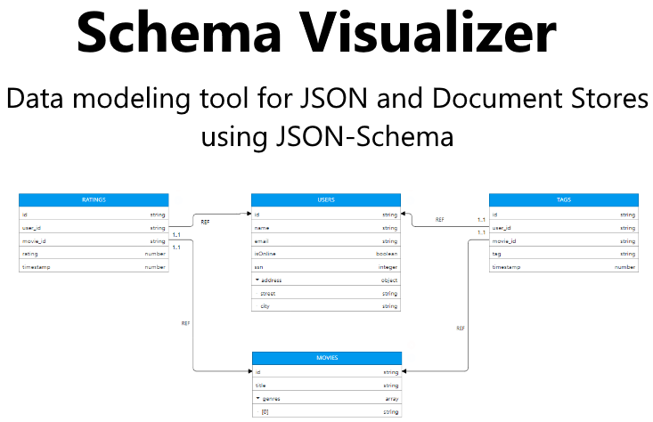

<p align="center">
  
</p>


[](https://github.com/shamilnabiyev/schema-visualizer-v2?style=flat-square)


# Schema Visualizer

Schema Visualizer is an online data modeling tool for JSON and document based databases (document stores). It can be also used to visualize JSON data and JSON-Schema.

*Live demo*: [https://schemavisualizer.com](https://schemavisualizer.com)

## Installation

```yarn install```

## Development 

```yarn run dev```

## Production build

```yarn run build```

## Used libraries

  * [Bootstrap](https://github.com/twbs/bootstrap)
  * [JointJS](https://github.com/clientIO/joint)
  * [JSON Editor](https://github.com/josdejong/jsoneditor)
  * [JSON S Generator](https://github.com/mowgliLab/json-s-gen)
  * [Webpack](https://github.com/webpack/webpack)

## Example Data Models

 

<hr>

 
