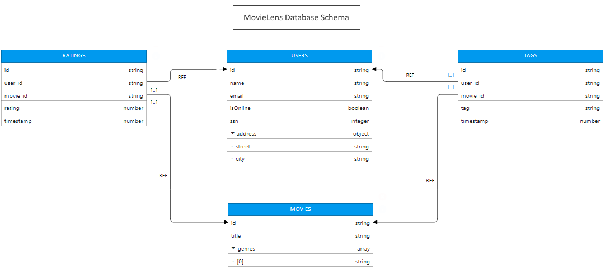
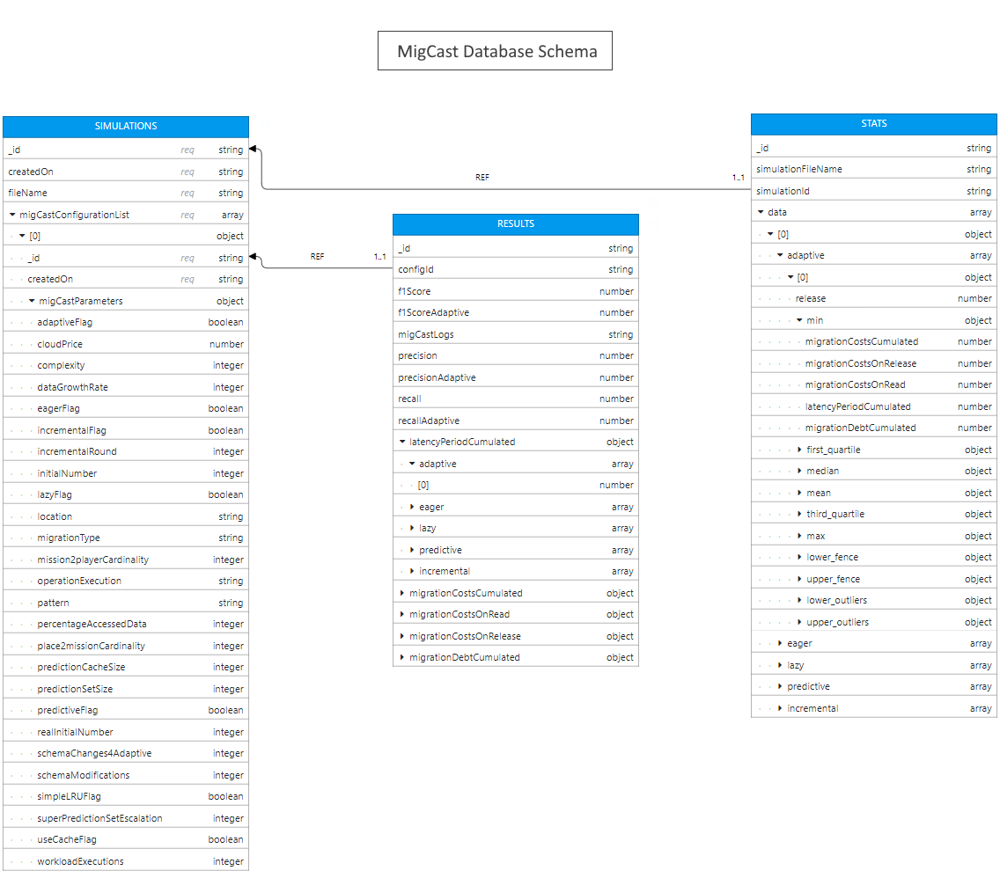

# Schema Visualizer

Schema Visualizer is an online data modeling tool for JSON and document based databases (document stores). It can be also used to visualize JSON data and JSON-Schema.

*Live demo*: [https://schemavisualizer.com](https://schemavisualizer.com/)

### Example Data Models

 

 
