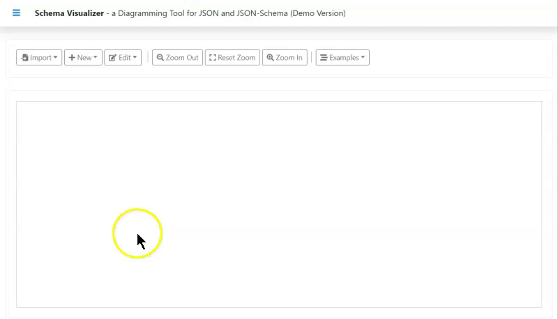
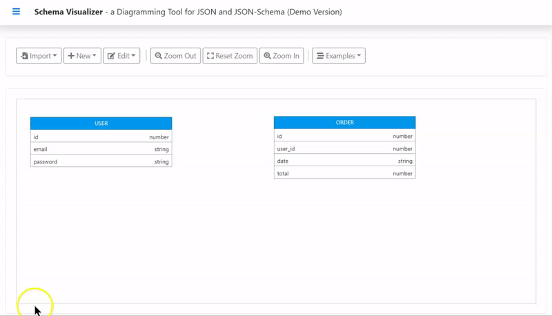
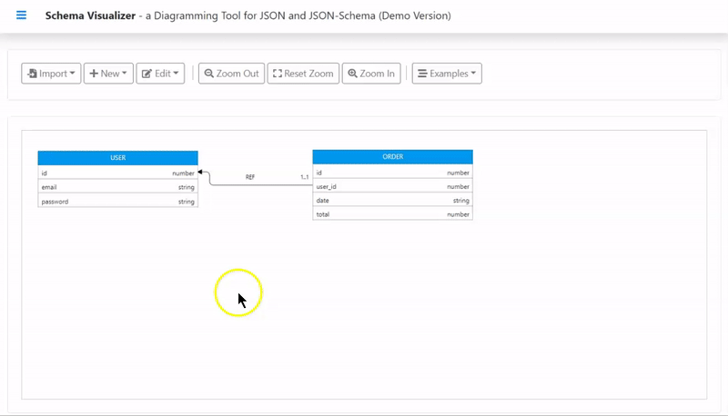
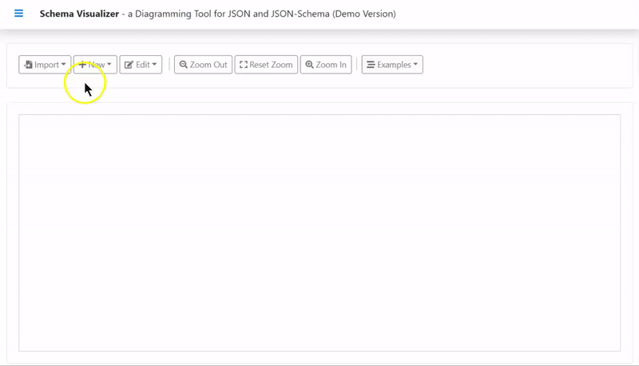
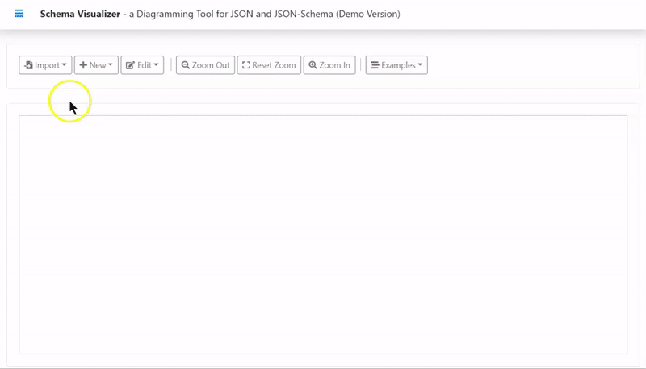

<p align="center">
  
</p>

# Schema Visualizer

Schema Visualizer is an online data modeling tool for JSON and document based databases (document stores). It also can be used to visualize JSON data and JSON-Schema.

## Installation

```yarn install```

## Development 

```yarn run dev```

## Production build

```yarn run build```

## Used libraries

  * Bootstrap: https://github.com/twbs/bootstrap
  * JointJS: https://github.com/clientIO/joint
  * JSON Editor: https://github.com/josdejong/jsoneditor
  * JSON Schema Generator: https://github.com/mowgliLab/json-s-gen
  * Webpack: https://github.com/webpack/webpack

## Examples

### How to create a new entity type

 

---

### How to reference an entity

 

---

### How to zoom in/out

 

---

### How to import a JSON document

 

---

### How to import a JSON-Schema

 

---

### MovieLens Database Schema Diagrams

 

---

### MigCast Database Schema Diagrams

 

---
